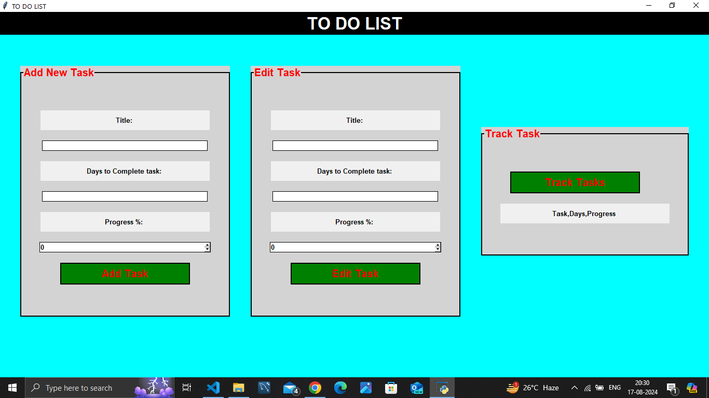

# Simple TO-DO Application
A simple and user-friendly Todo Application developed in Python using the Tkinter library.


## Table of Contents
* [Description](#description)
* [Features](#features)
* [Installation](#installation)
* [How to run the application](#how-to-run-the-application)
* [Usage](#usage)
* [Requirements]()
* [Licenses](#licenses)
* [Acknowledgment](#acknowledgment)
* [Resources](#resources)

### Description
This is a To-Do list application built with python's Tkinter that allows users to manage and organize task efficiently.
Users can create, update, and track their to-do lists.

### Features

- **Task Management:** Easily add, cross-out, uncross-out, delete crossed-out task and delete selected tasks.
- **Task List:** View all tasks with titles and due dates, color-coded for better organization.
- **Save and Load:** Tasks are saved and loaded using the menu buttons(open, save, clear, and exit).

### Installation
#### How to run the application
* To use the application, you need to clone or download the repository to your local pc code editor terminal.
```git clone https://github.com/Baig-fatema/CODSOT/Todo_List.git```
* then, change directory to the todo list directory
```cd ./Todo_List/```
* run the to-do.py file
```python main.py```

## Usage
1. **Adding a Task:**
   - Click the "Add Task" button.
   - Fill in description.

2. **Editing Task:**
   - Enter a task title from the list.
   - Change the descriptions.
   - To uncross: Click "Edit task" button.

3. **Tracking Task:**
   
   - Click the "Track task" button to remove it.


## Requirements
  * Python 3.x
  * Tkinter library (usually included with Python)

## License
This project is licensed under the MIT License


## Acknowledgments
Thanks to the [Python](https://python.org) and [Tkinter](https://docs.python.org/3/library/tkinter.html) communities for their excellent documentation and resources. Also a sincere appreciation goes to @CODSOFT for the internship opportunity given to me that brought about this project.

## Resources
- [Python](https://python.org)
- [Tkinter](https://docs.python.org/3/library/tkinter.html)
- [Geeksforgeeks Tutorial](https://www.geeksforgeeks.org/python-gui-tkinter/)
- [Codemy](https://youtube.com/Vm0ivVxNaA8?si=0989P1RDKZRabFz)

# Author
[Charles Lughas](https://github.com/Baig-fatema)
